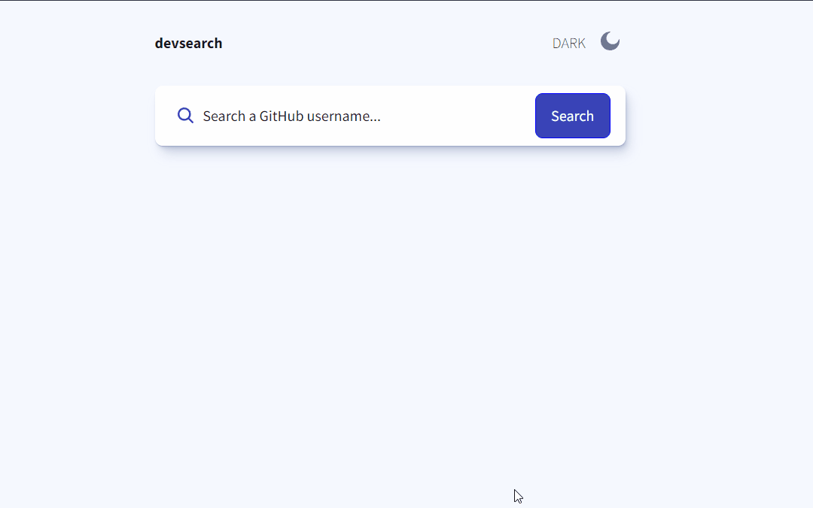

<h1 align="center"> Search a Dev </h1>

<p align="center">
  <a href="#-tech">Tech</a>&nbsp;&nbsp;&nbsp;|&nbsp;&nbsp;&nbsp;
  <a href="#-project">Projeto</a>&nbsp;&nbsp;&nbsp;|&nbsp;&nbsp;&nbsp;
  <a href="#-getting-started">Getting Started</a>
</p>

## Working Project



## Tech

- Nextjs
- Typescript
- Styled-components

## Getting Started

Clone the project and access the folder.

```
git clone https://github.com/filipesaretta/search-dev-github

cd search-dev-github
```

Install the dependencies and start.

```
npm install

npm run dev
```

## Project 

It was to practice my skills with typescript, nextjs and styled-components. It was base on a design from frontendmentor.

